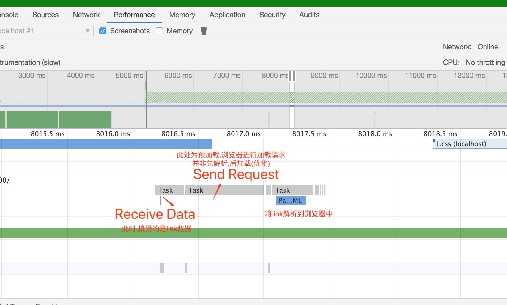
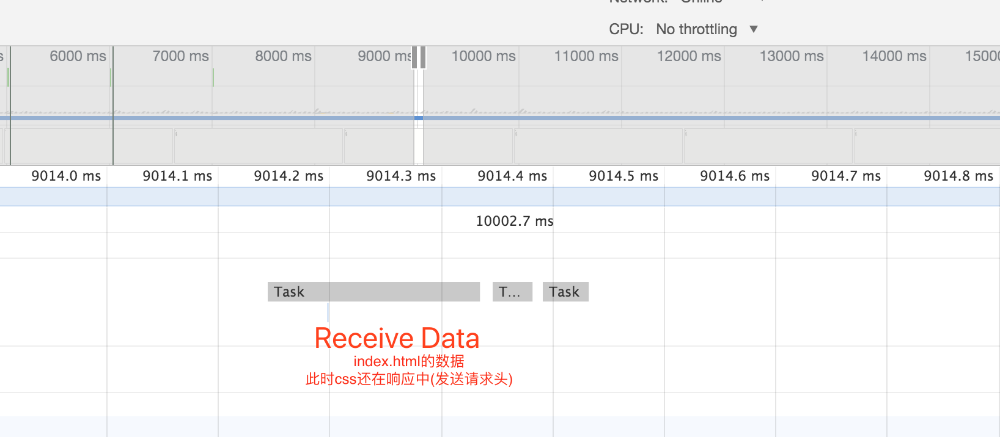
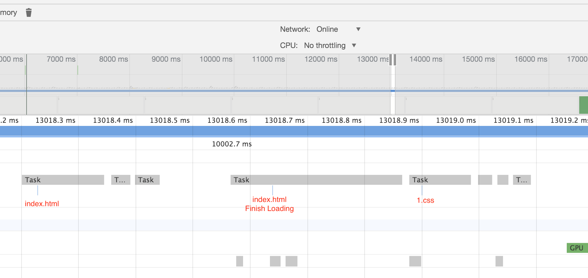
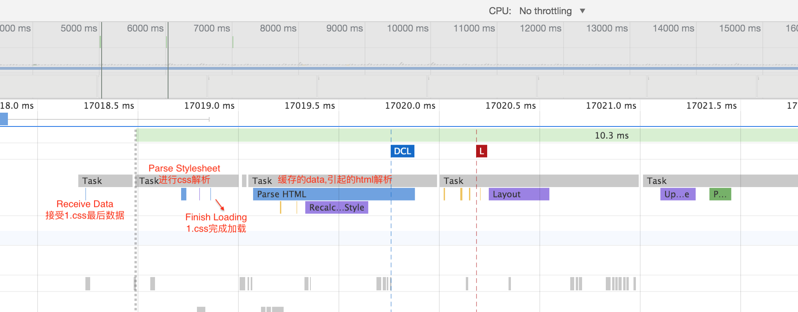

## 描述
既然我们知道了,网络进程收到数据后,会丢给渲染进程处理

那有额外的网络请求时,浏览器又会如何处理?

今天我们探讨的就是外联的css

## 环境
css阻塞时众所周知

按照上个例子的思路,我们要探讨的是当我们在html第9行插入一段外联css

```html
HTTP/1.1 200 OK
Content-Type: text/html; charset=utf-8

<html lang="en">
<body>
    <div>1</div>
    <div>2</div>
    <div>3</div>
    <link rel="stylesheet"  href="1.css" >
    <div>4</div>
    <div>5</div>
    <div>6</div>
</body>
</html>
```
css格式如文中所示,也是一行一行,共需9s加载完成
```css
HTTP/1.1 200 OK
Content-Type: text/html; charset=utf-8

body{
    background: red;
}

body{
    background: green;
}
```
在已知css会阻塞渲染的情况下,那么对于浏览器的显示呈现那种情况?

浏览器显示3后
- 下载css
- 5s后背景红色
- 10s后背景绿色
- 随后依次展示4,5,6

注:上述的描述大部分都是错的

## 现象
执行`node index.js`，在浏览器中输入`http://127.0.0.1:3000/`

这里可观察到的现象非常明显

- 3以后停顿10s
- 背景色变绿
- 直接显示4，5，6
- css加载结束后,浏览器的loading状态才取消


## 解释
解释这几个现象并不复杂,点击performance
- 8s


首先执行的是Receive Data 注意(这里接收到的数据是link)

下一个执行的是Send Request,这是预解析,如果请求的内容包含链接,比如link,那在在Receive Data后直接进入send,而非先渲染后加载

最后是Parse HTML的渲染流程,即将link打入html中

- 9s

只有一个Receive Data
此时,css还在请求头阶段

- 10,11,12


主线程接受了两个网络进程的任务Receive Data
依然没有触发Parse HTML
注意,css开始传输数据了


- 13s

触发了html的Finish Loading
但是css依然没有结束

- 17s


一直到17s,css加载完成

执行Parse Stylesheet

随后,触发Parse HTML(指阻塞的其他html),以及后续的渲染流水线

而这个时候,Receive Data已经接受完了所有的数据

换句话说,对于css的解析并非如html那般实时解析,而是一步到胃【只在加载完数据后,才会触发Parse Stylesheet】

而在下载css时,并不会影响其他网络请求,只是渲染请求系列的事件,比如Parse HTML都不会被触发,直到触发了Parse Stylesheet为止

知道了这个现象,那就可以尝试解释如下情况

1.如果Receive Data收到两个link,会如何处理?

2.如果两个link一块一慢,比如1.css需要4s加载,背景红色,2.css5s加载,背景绿色页面会
有如何变化? 
    
可运行index2.html进行查看

结论:

每个link会个触发一次Parse Stylesheet(可能会与最后一个parse html 合并),也就是先红后绿

3.如果在加载link中,Receive Data接受的数据远超64K数据,浏览器如何渲染? 

可运行index3.html进行查看

结论:

与网速超快一样(本地打开html3)

4.在link下还有一个link需要下载,是否会阻止link进行下载

可运行index4.html进行查看
(不同于index2.html,index2.html属于一段响应包含多个请求,index4.html属于多个响应,每个响应一个请求)

结论:

预加载会分析接收到的数据,并进行网络请求,预加载不属于渲染故并不会阻止下载

## 总结
最后总结一下

- css的下载会阻塞其他渲染事件的执行,直到执行完Parse Stylesheet
- 在此之间,并不会对网络进程产生影响
- 因为不想让客户看到裸皮肤的样式,故css通常在header中