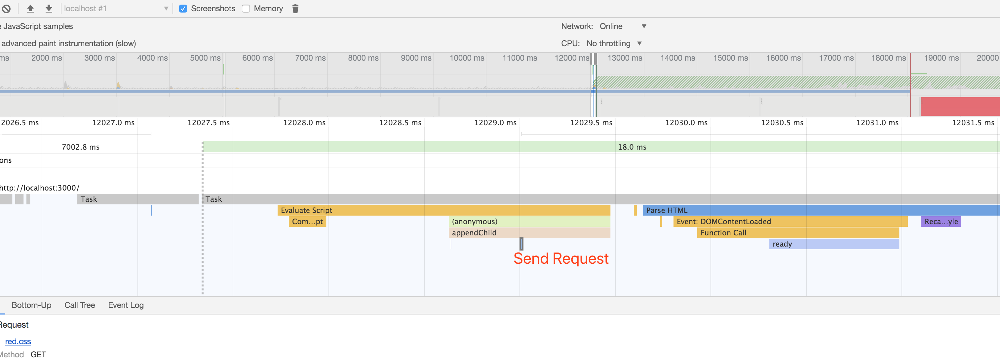
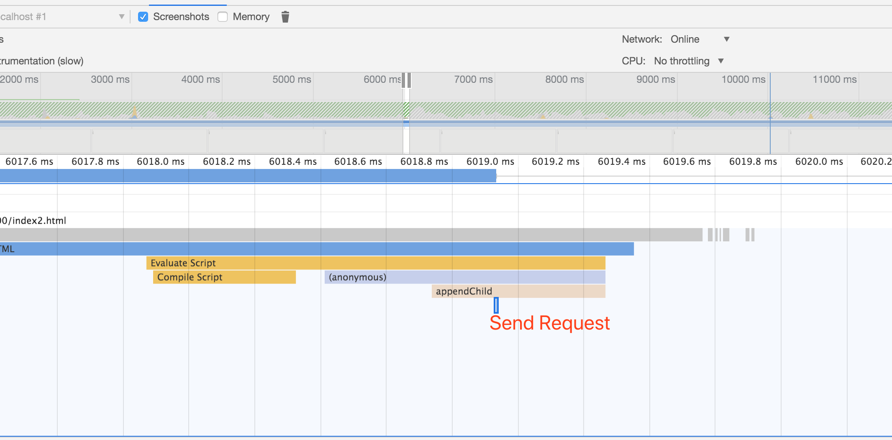
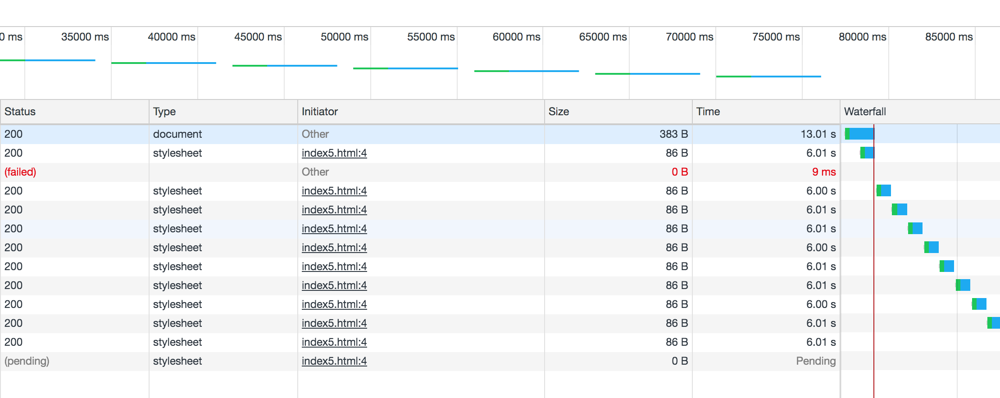

## 描述

js的阻塞,整体与css类似,唯一的区别在于css的解析是可预测的

而js的解析不可预测,他可能包括修改dom,乃至动态加载


## 环境
那这里,我们只探讨与加载有关且与css不同的加载现象--动态记载

如在外联/内联的js中,如果动态请求css,对浏览器会产生如何影响？

A.阻塞
B.不阻塞
## 现象
执行`node index.js`，在浏览器中输入`http://127.0.0.1:3000/`
这里可观察到的现象非常明显

- 加载js会进行阻塞,无法渲染后续的html
- js加载完成后,进行解析,但动态css不会进行阻塞
- 直到下载完css,loading状态才结束


内联的方式更加明显
- js加载完成后,进行解析,但动态css不会进行阻塞
- 直到下载完css,loading状态才结束

## 解释
解释这几个现象并不复杂,点击performance
- 在appendChild中找到了`Send Request`方法

外联js

内联js

换句话讲,动态加载取消了css的阻塞特性

这里要强调一个概念,对于html渲染而言,他有两大周期

- 加载期
- 交互期

这两大周期主要与消息队列的优先级有关

不过到目前,我们可以简单的把加载期在区分为网络协调和提前交互两个阶段

也就是我们一般认为的浏览器转loading的阶段并非不能交互,除非是开始的大白屏

而交互阶段是不存在阻塞问题的

没错,css加载阻塞特指的是加载期的渲染现象

## 动态加载css顺序
当然,动态加载也遵循加载顺序,而非下载完顺序,这与直接连接表现是一致的 
如index3.html,先加载red,在加载green,如果红色先加载完,背景色先红后绿,否则只有绿无红

动态加载css一定要小心,它会让用户看明显的变化,而且,动态加载引起的样式污染很难发现

## 无限loading与缓存规则
还有几个问题

动态加载的内容属于loading,假设使用setInterval,无限加载css/js是否可以形成无限loading?

动态加载是否包含合并?


index5.html(加载red.css需要6秒,1s进行一次加载循环)
```html
<script>function a(){
    let link = document.createElement("link");
    link.rel="stylesheet";link.href="red.css";
    document.body.appendChild(link);};
    setInterval(()=>{
        a();
        a();
        a()
    },1000)</script>
```

有三个现象
- 查看html,每秒生成三个link

    setInterval的作用,不解释

- 每6秒生成一个css

    url合并规则,即加载中的url,不会进行重复加载

- 没有形成无限loading
    url被合并了,http"中断"（http/tcp协议）


查看index8.html,如果css加载没有失败，可以实现loading无限加载的状况

## 缓存规则
静态html加载js相同的url,会直接不在请求 --》 index4.html

对于加载期请求,并非加载单例,而是加载期单例 --》 index7.html

而动态加载,无视缓存(但一次只有一个请求) --》 index5.html

如果在加载期加载link已存在的css,加载会合并 --》 index6.html


缓存规则与资源加载器(源码)有关,此处不做探讨

了解了这些,应该也可以清楚

为什么有时候会要求script放在表头,使用async与defer处理,而非直接放在body后(提前加载时间)


## 总结
最后总结一下,js的阻塞与css阻塞一致,也是加载完后,统一进行解析

如果有动态加载,属于交互期事件,不存在我们要讨论的加载阻塞问题

