## 描述
这一期,我们聊一下浏览器的渲染,html的渲染流程大致分生成与计算布局(重排),绘制(重绘)三部,整体结构如下


- 1.将 HTML 内容转换为dom
- 2.CSS 转换为 cssom/styleSheets
- 3.创建布局树
- 4.创建分层树
- 5.创建绘制列表，提交到合成线程(进入合成)
- 6.光栅化
- 7.返回给浏览器主线程
- 8.显示器显示

这一期,我们聊一下html内容生成dom,并根据performance观察后续几个步骤所做的操作
## 环境
测试例子只有两种

一种简单的html,如index1.html
```html
    <div>1</div>
    <div>2</div>
    <div>3</div>
```
另一种为超长的,如index2.html

## 现象
双击使用浏览器打开,并执行`performance`,针对简单的html,查看`Main`可看到
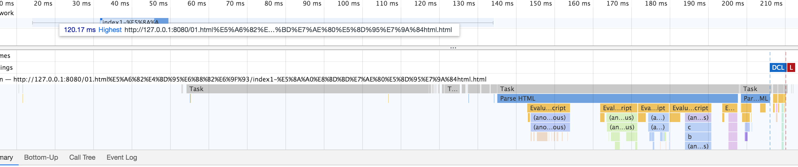

注:

本地加载与网络加载表现有所区别,当请求为本地地址时,`network`与performance中`network`如下
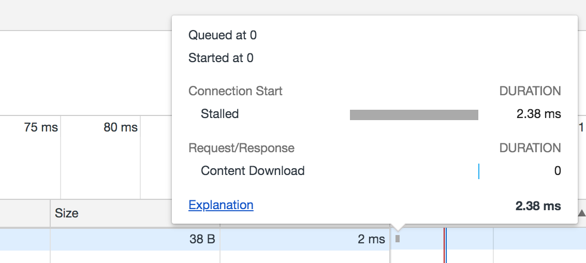
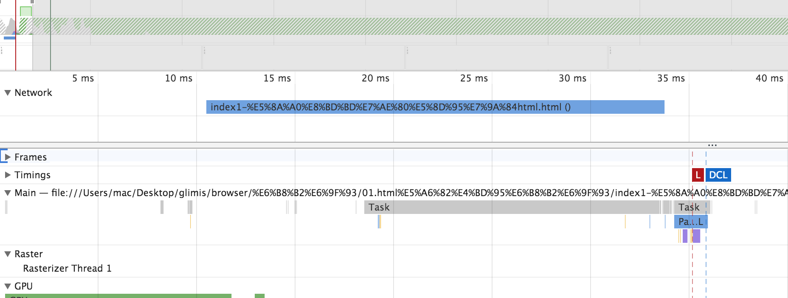

当请求连接为网络连接时,请求如下
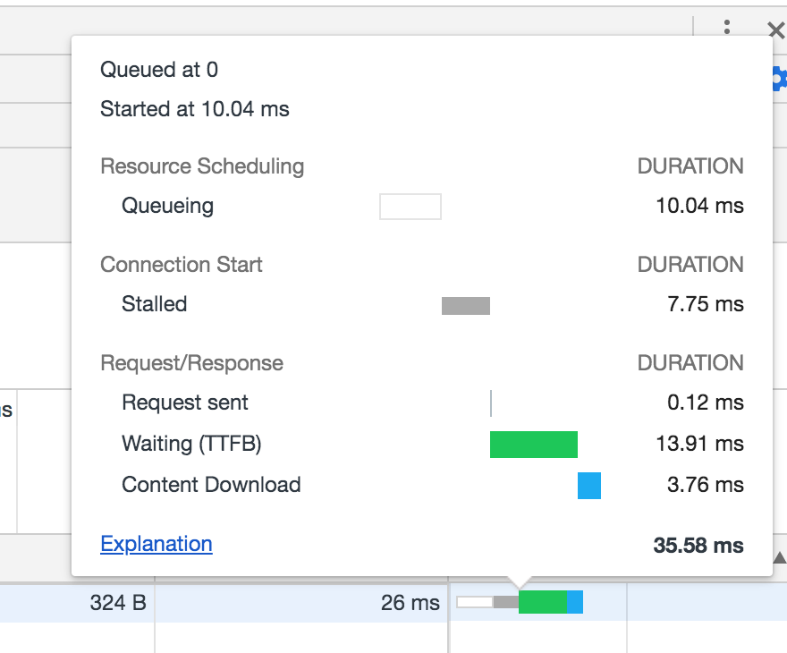


此处通过`http-server`,以查看真实网络环境的渲染情况

点击`network`，查看如下内容
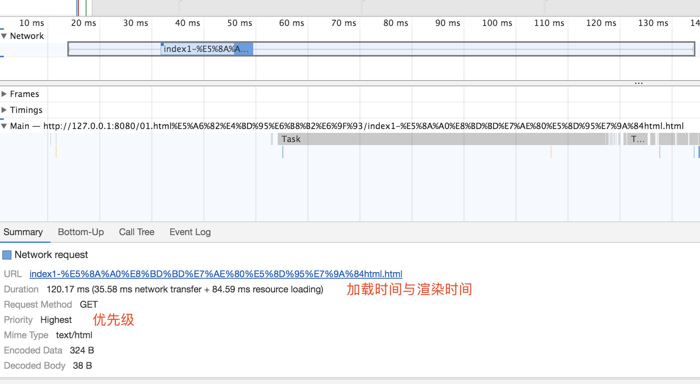
35.58 ms 加载时间 + 84.59 ms 等待时间(main为单线程,故存在等待时间)
 

- 触发`beforeunload`

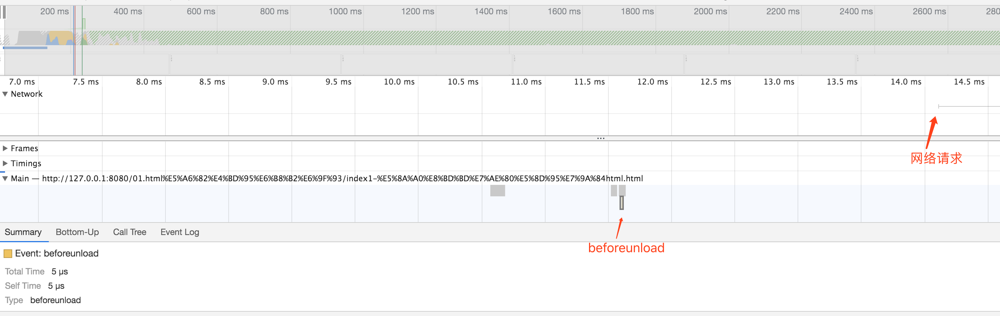     

当浏览器窗口关闭或者刷新时

- 2.Send Request

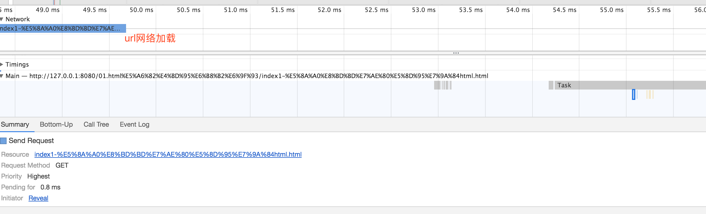  

注:
Send Request表示发送请求(第一个除外)

第一个请求,需要确定解析方式以决定是否由浏览器解析,故第一次Send Request在请求响应返回之后(表现为network内)

- 3.Receive Response

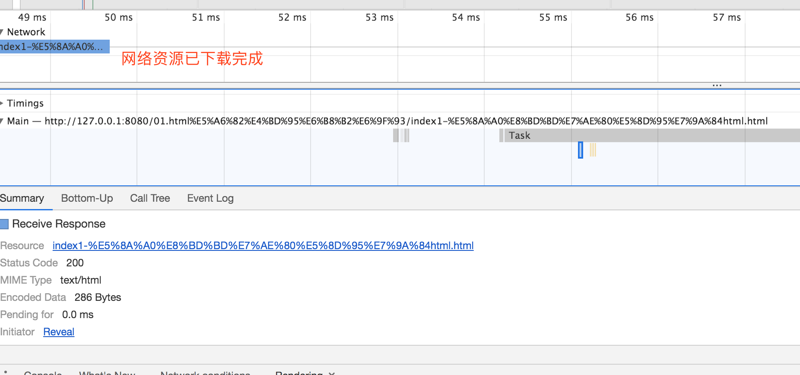  

接受请求响应

main是执行事件循环的线程,两个任务并不会因为已获取资源而进行合并


- 4.执行卸载任务
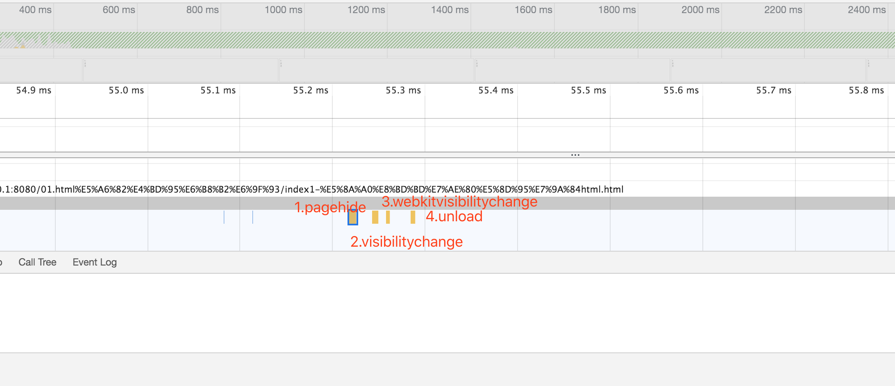  
依次执行pagehide,visibilitychange,webkitvisibilitychange,unload
- onpagehide
用户离开网页时触发
- visibilitychange
页面被隐藏或显示的时触发
- webkitvisibilitychange
同上
- unload
资源卸载
- readystatechange
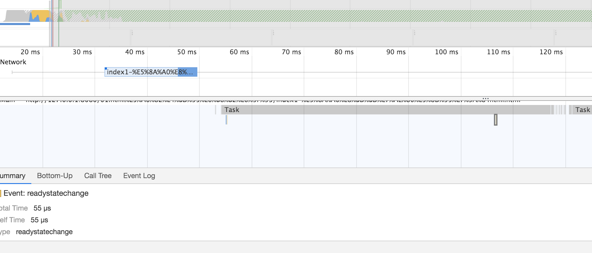  
readyState发生改变,此处指uninitialized,未加载

注:卸载任务主要为上一个页面的js,此时新的页面并没有ParseHtml,并没有解析js

- 5.接受数据与结束接受
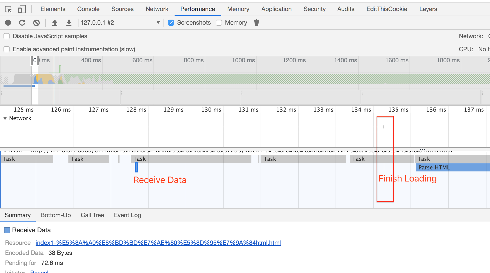  
Receive Data:接受数据

Finish Loading:加载结束,此时网络中断

- 6.解析dom
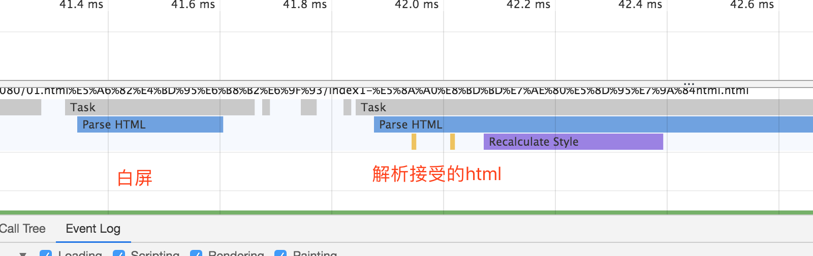  

Parse Html,在解析过程中，包括计算布局(重排)


- 6.1 解析dom-执行生命周期
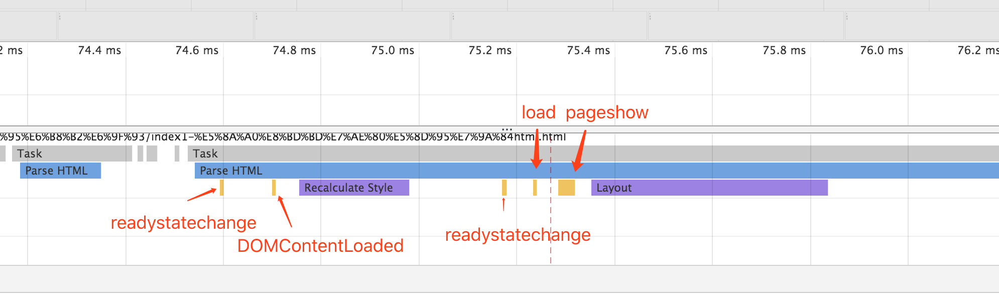  

readystatechange:
interactive,进入交互期

DOMContentLoaded:
dom内容加载完毕

readystatechange:
complete,进入完成

load:
所有的资源加载完成,在页面从浏览器缓存中读取时不触发

pageshow:
加载页面时触发

- 6.2 解析dom-布局

Recalculate Style:
dom与css合并(重新计算样式,生成渲染树)

Layout:
图层树

- 7.绘制与合成
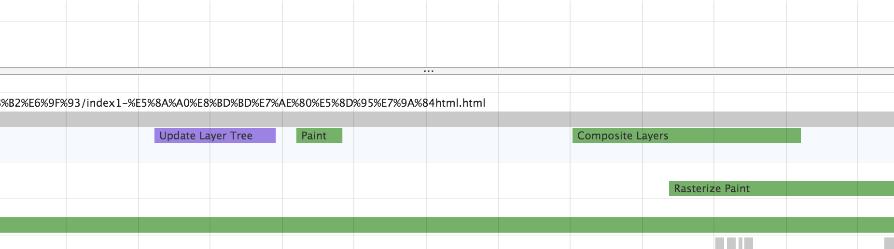  

Update Layer Tree:更新图层(被系统任务分割,与事件循环优先级有关)

Paint:绘制

Composite Layers:合成

### 超长文本
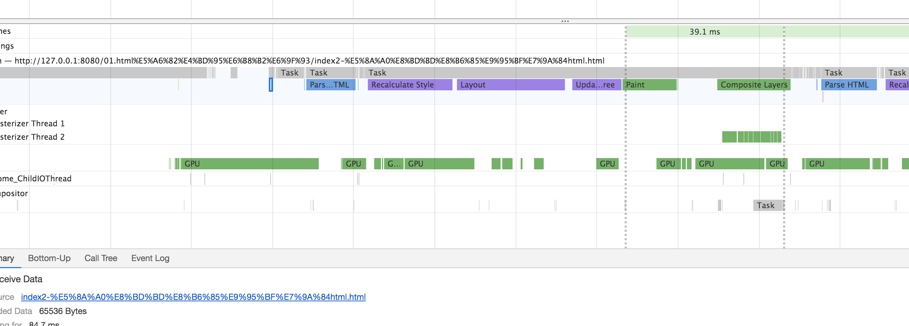  

与之前类似,但每次`Receive Data`只有64K

## 总结
解析html,并非一步到位,会根据大小与系统任务,进行渲染任务打散
