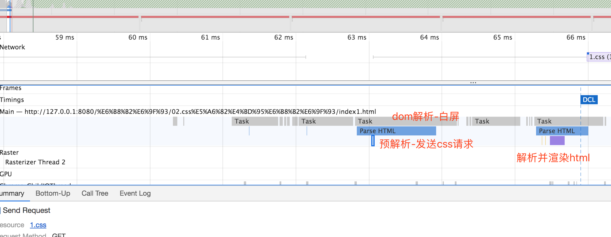
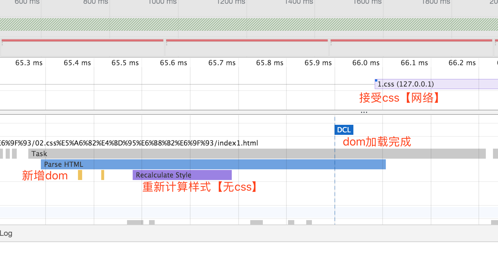
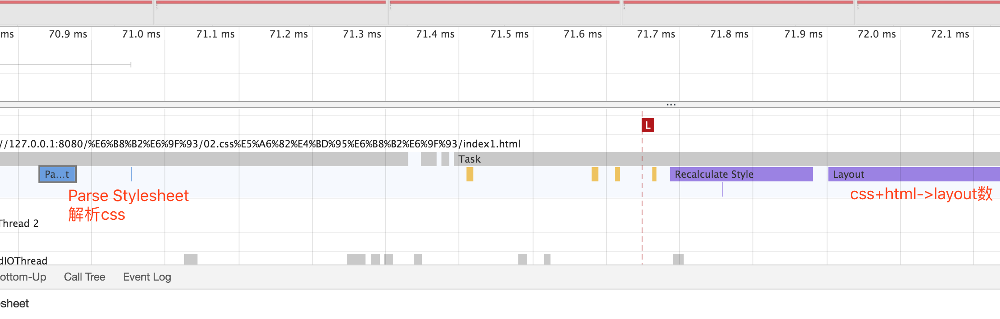
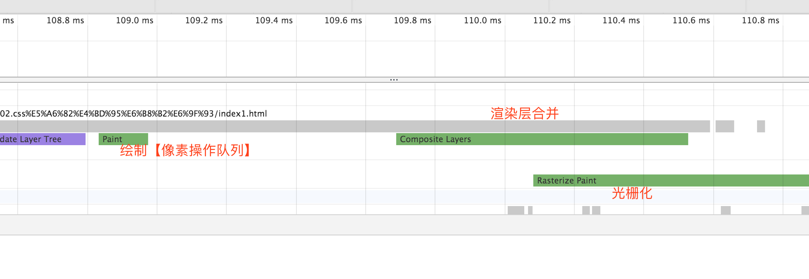
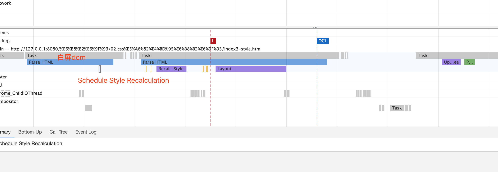
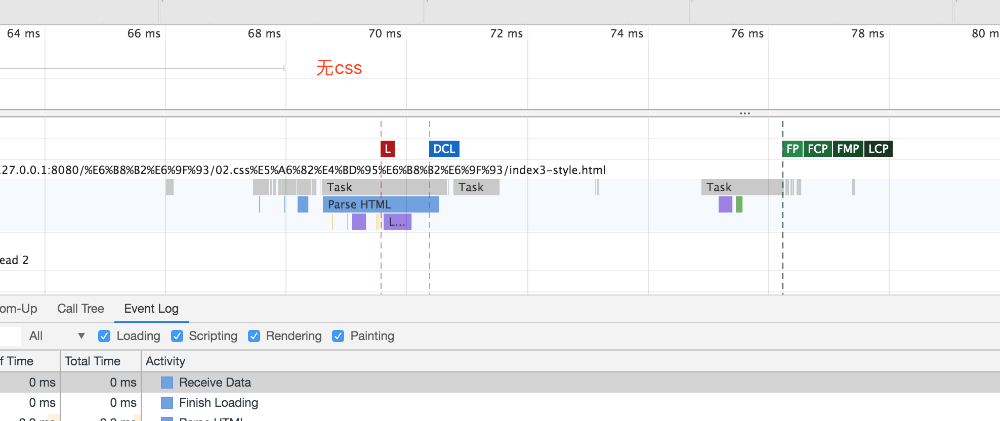
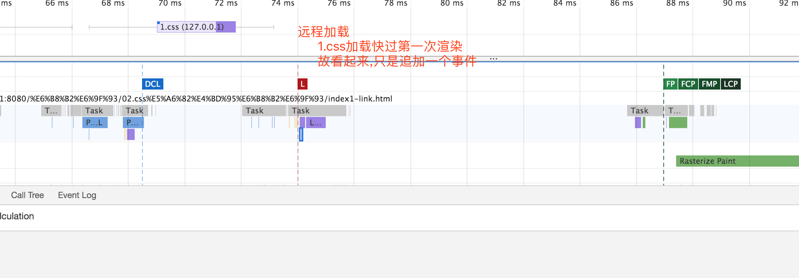
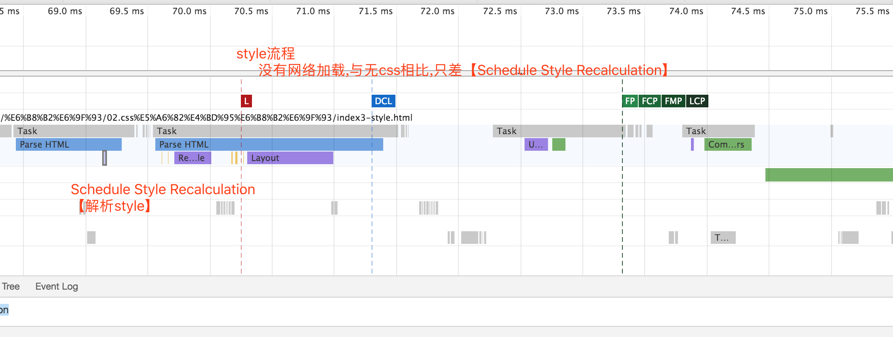
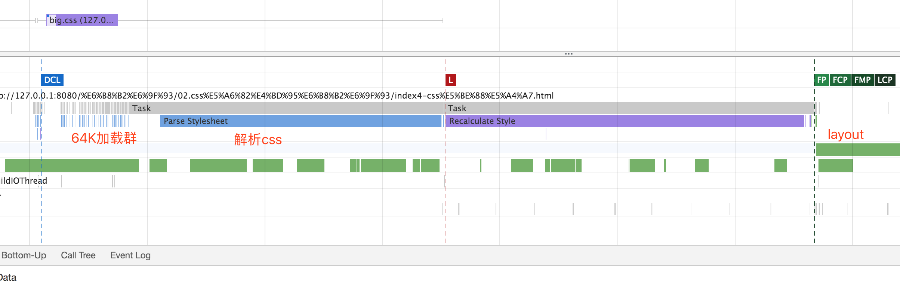
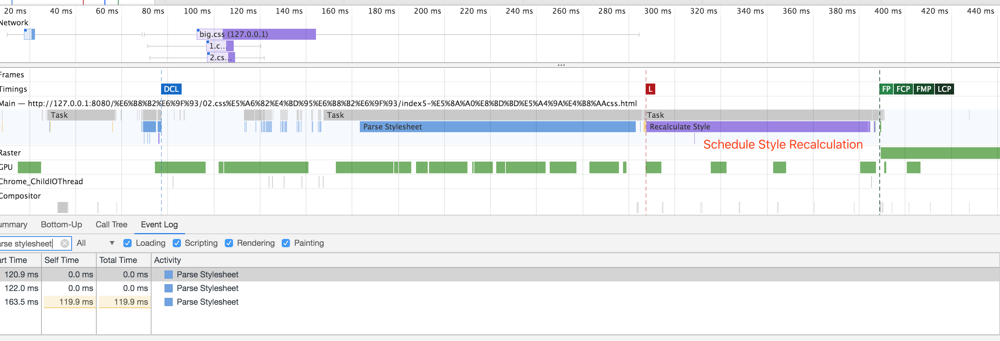

## 描述

通过link标签与style 渲染中的区别

## 使用link

去掉link,可看到,主要减少了parse stylesheet
其他主要步骤不变

## 使用style

## 对比

## 假设 -> index4
1.css很大 or 占用时间,引起第一次layout 后会怎样？

阻塞加载

## 假设 -> index5
加载多次css

## 总结

对于浏览器初始化【除了64K与js】
css只会增加只会增加`parse stylesheet`
此时只有一次layout，甚至只有一次 `Style Recalculation`
