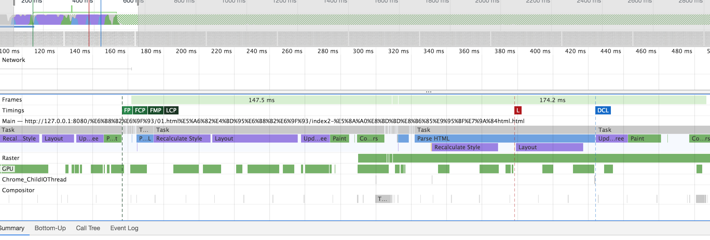

## 描述

通过link标签与style 渲染中的区别

## 使用link

去掉link,可看到,主要减少了parse stylesheet
其他主要步骤不变

## 使用style

## 对比

## 假设 -> index4
1.css很大 or 占用时间,引起第一次layout 后会怎样？

阻塞加载

## 假设 -> index5
加载多次css

## 假设 -> index6
加载超大html【解析html-超大html】

## 总结

对于浏览器初始化【除了64K与js】
css只会增加只会增加`parse stylesheet`
此时只有一次layout【First Paint】，甚至只有一次 `Style Recalculation`

注:
    
    Parse Stylesheet 与parse html 类似,产生document.styleSheets
    
    Recalculate Style dom与css合并 renderTree【内存中】
    layout Layout树 取消不可显示内容

    Paint 绘制列表
    composite 合成